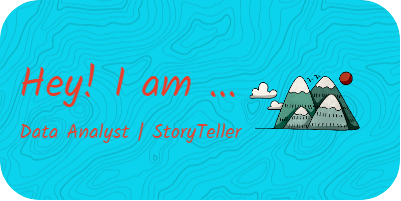

Hi there! I'm Liam. I am a data analyst who is passionate about environmental and social justice causes. I am in the process of obtaining my M.S. in Information Management with a specialization in Data Science from the University of Washington. I spend my days working as a Database Administrator at Morris Animal Foundation in Denver, CO

- 🔭 I’m currently working on ...
- 🌱 I’m currently learning ...
- 👯 I’m looking to collaborate on ...
- 🤔 I’m looking for help with ...
- 💬 Ask me about ...
- 📫 How to reach me: ...
- 😄 Pronouns: ...
- ⚡ Fun fact: ...
-->
